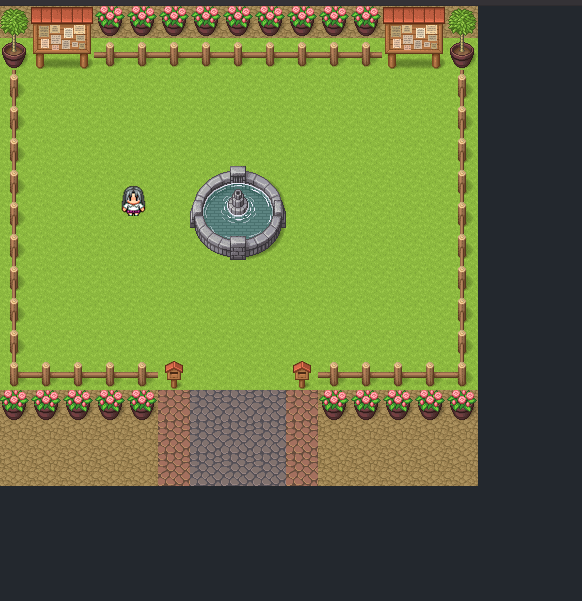

# RPG GAME COM REACT

## Descrição do projeto
Um mini game rpg feito com react.js e typescript. Apenas com o intuito de praticar ainda mais com o react.js, mas desta vez optei por utilizar o typescript em função de aprendizado. O jogo consiste em apenas 'andar' pelo mapa, afim de testar o sistem de colisão e limitação de areas em que o personagem poderá se locomover. 

Neste projeto foram utilizados os seguintes hooks personalizados do React

## Tecnologias utilizadas
- Typescript
- React.js
- styled-components

## Como rodar o projeto em sua máquina
- Clone este repositório.
- Utilize o comando `npm i` para instalar as dependências do projeto.
- Após instalar as dependências, utilize o comando `npm start` para inicializar a aplicação.
- A aplicação será executada na porta `3000` do seu navegador.
- Necessário possuir `typescript` instalado em sua máquina.

## Imagens do projeto

